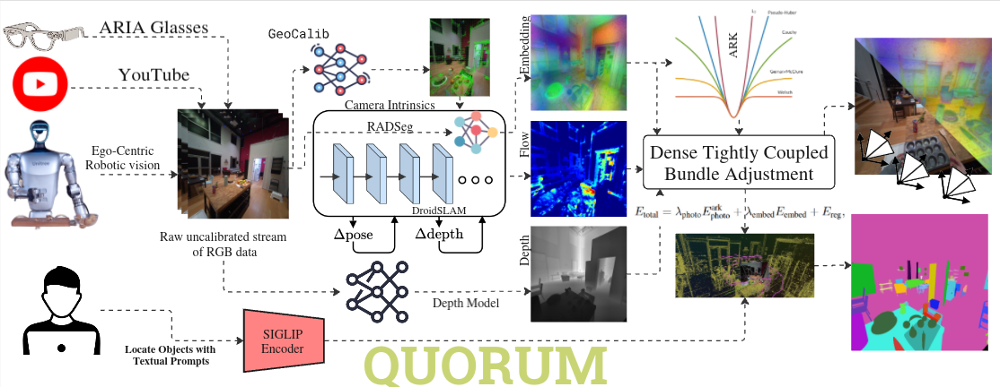

# QUORUM: Multi-View Feature Consensus for Open-Vocabulary SLAM in Dynamic Scenes

> **BE2R Lab** — Biomechatronics and Energy-Efficient Robotics Laboratory, ITMO University

🌐 **Project Page**: [be2rlab.github.io/quorum_site](https://be2rlab.github.io/quorum_site/)
## QUORUM is accepted at the 3rd Workshop on Neural SLAM (NeuSLAM) (ECCV 2026)

---



## Abstract

We present **QUORUM**, an online semantic SLAM system that enables geometry-aware open-vocabulary fusion, where multi-view high-level features vote for a dense pixel-level visual-language embedding field. These embeddings are consumed at four stages of the SLAM stack: the optical-flow prior, factor graph topology, a cross-view residual inside dense bundle adjustment, and the per-pixel shape of the robust kernel. This fusion in BA is wrapped by a temporal stability field that aggregates cross-view embedding agreement, separating genuinely static surfaces from actively moving objects which improve robustness in dynamic environments. Unlike existing approaches that require calibrated, posed RGB-D input, QUORUM operates directly on raw monocular RGB video streams, requiring no prior camera intrinsics, depth sensors, or pose initialization. Experiments demonstrate that QUORUM achieves state-of-the-art results on the dynamic TUM-RGBD benchmark while maintaining competitive performance against offline open-vocabulary methods that rely on calibrated data and static scene assumptions. QUORUM bridges a critical gap in real-world deployment, enabling robust open-vocabulary semantic grounding for autonomous robotics and unconstrained in-the-wild video streams.


---

## Installation

### Docker

```bash
# Build the Docker image
make build

# Run the Docker image
make DATA_DIR={YOUR_DATA_DIR} run

# Inside the container, install the package
pip install --no-build-isolation -e .
```

---

## Usage

```bash
# Run the full pipeline
python run.py pipeline=default streams=raw_mp4_stream streams.base_path=YOUR_VIDEO_OR_DIR_PATH

# Run the pose-only pipeline (without depth estimation)
python run.py pipeline=default streams=raw_mp4_stream streams.base_path=YOUR_VIDEO_OR_DIR_PATH pipeline.post.depth_align_model=null
```
##### For visualization, pass `--visualize` with the commands above.
---

## Evaluation

### Semantic Segmentation evaluation

Semantic segmentation evaluation uses code borrowed from the [RayFronts](https://github.com/RayFronts/RayFronts) repository.


> For Replica, we use the NiceSlam version and we get the GT semantic labels from HOV-SG (Uploaded [here](https://cmu.app.box.com/s/x7si4h8y4sfk07dgmn9uwowaf2g74zjw) for convenience) since NiceSlam does not provide semantic labels without the original dataset.
>
> — *cited from [RayFronts](https://github.com/RayFronts/RayFronts)*.

Run evaluation with one of the prepared configs:

```bash
python scripts/semseg_eval.py --config-name semseg_configs/replica_kmvipe
```

If you want to run evaluation for all the scenes:
```bash
python scripts/semseg_eval.py \
  --config-name semseg_configs/replica_kmvipe \
  --multirun \
  semseg_configs.dataset.scene_name=office0,office1,office2,office3,office4,room0,room1,room2
```

Expected outputs are saved under `eval_out/<experiment>/<DatasetName>/<scene>/`.

### RMSE evaluation

RMSE evaluation is performed using the shell scripts provided in `scripts/`, for example:

```bash
scripts/slam_evaluation_replica.sh
```

These scripts run the SLAM pipeline on the corresponding dataset and compute RMSE metrics for the generated trajectories.

## Grounding

The visualizer supports **open-vocabulary text-based grounding**: given a text prompt (e.g. `"chair"`, `"car"`), it highlights matching object instances in the map, clustered into per-instance oriented bounding boxes with DBSCAN.

Minimal example:

```bash
python -m scripts.grounding /path/to/map.pt \
  --pca-basis /path/to/pca.pt \
  --ground "chair" \
  --show-object-points
```

Key flags: `--ground` (the text prompt), `--threshold` (similarity cutoff, adaptive — lower it if nothing matches), `--cluster-eps` (DBSCAN neighborhood, **the main thing to tune per scene**), `--no-bbox` (skip boxes when multiple instances merge into one giant box).

For the full pipeline description, parameter tuning by scene type, and troubleshooting, see **[scripts/grounding.md](scripts/grounding.md)**.

---

## Acknowledgments

QUORUM builds upon many outstanding open-source research projects and codebases, including (non-exhaustive):

| Project | Reference |
|---|---|
| RAD-SEG | [arXiv:2511.19704](https://arxiv.org/abs/2511.19704) |
| KM-ViPE | [arXiv:2512.01889](https://arxiv.org/abs/2512.01889) |
| RayFronts | [arXiv:2504.06994](https://arxiv.org/abs/2504.06994) |
| ViPE | [GitHub](https://github.com/nv-tlabs/vipe?tab=readme-ov-file) |
| RADIO | [arXiv:2601.17237](https://arxiv.org/abs/2601.17237) |
| DINOv3 | [GitHub](https://github.com/facebookresearch/dinov3) |
| Talk2DINO | [GitHub](https://github.com/lorebianchi98/Talk2DINO) |
| RVWO | [GitHub](https://github.com/be2rlab/rvwo) |
| UniDepth | [GitHub](https://github.com/lpiccinelli-eth/UniDepth) |

---

## License

This project will download and install additional third-party **models and software**. Note that these are not distributed by NVIDIA — please review their respective license terms before use.

This source code is released under the [Apache 2.0 License](https://www.apache.org/licenses/LICENSE-2.0).
